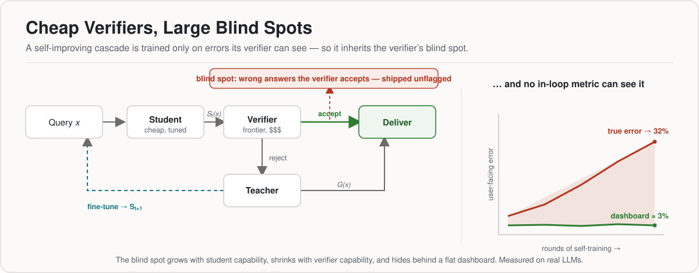

# Cheap Verifiers, Large Blind Spots

**Measuring the Reliability Cost of Cost-Saving Cascades**
Dushyant Rajput · Nirdesh Chauhan · Siddharth Kosaraju · AltSlate Labs LLP

<p>
  <a href="LICENSE"></a>
  <a href="paper.pdf"></a>
  
  
  
</p>

<p>
  
  
  
  
  
</p>

<p align="center">
  
</p>

Code and data for the paper. A cost-saving inference cascade answers most queries
with a cheap *student* model and escalates a hard tail to a frontier *verifier*. A
natural extension closes the loop — fine-tune the student on the verifier's
rejections so escalation, and cost, fall each round. We measure that loop on real
LLMs and report four findings:

1. **The verifier's blind spot** — the fraction of the student's wrong answers it
   accepts — **grows with student capability** (β from 0.12 to 0.55 as the student
   scales 0.5B→32B) and **shrinks with verifier capability**, so it is worst exactly
   in the cheap-student, cheap-verifier regime cascades exist to create.
2. **Buying it away returns the saving**: a frontier verifier drives β to ≈0.05 but
   then escalates on 46% of hard-MATH queries against a 39% true error rate.
3. **Naive corrective fine-tuning degrades and collapses** the small student, across
   every teacher we tried (cross-family and same-family) — the "self-improving" loop
   is self-defeating at this scale.
4. **None of it shows on the dashboard**: every verifier-computed metric reads a flat
   ≈3% error while true delivered error swings to 32%.

A two-population **conservation law** (ε∞ ≲ q₀·β₀) explains why no in-loop metric can
see any of this, and a synthetic study validates the mechanism where the loop
provably improves the student.

📄 **Paper:** [`paper.pdf`](paper.pdf) · arXiv: _(to be assigned)_

## Repository layout

```
paper.typ / paper.pdf     the paper (Typst, arXiv-style via arkheion + cetz)
refs.bib                  bibliography
figures/                  vector + raster figures embedded in the paper
experiments/
  phase0_synthetic.py     synthetic mechanism study (§7, H1–H4)  — CPU, ~1 min
  h5_mitigation.py        synthetic mitigation exchange rates (§7, H5) — CPU
  RESULTS.md, results*.txt synthetic results
  phase0_real/            real-LLM measurements (§5)
    run_phase0.py         the corrective/frozen loop (LoRA fine-tuning)
    sweep_capability.py   β vs student size (Figure 3)
    math_sweep.py         β vs verifier strength on hard MATH (Figure 4)
    pregen_teacher.py     cache a same-family teacher's solutions
    make_real_figures.py  render Figures 2–4 (with 95% Wilson CIs)
    RESULTS_REAL.md       real-model results and run notes
    *_results.json        committed measurements the figures are built from
```

## Reproduce

### Synthetic study (CPU, no keys)

```sh
cd experiments
python3 phase0_synthetic.py     # H1–H4, ~1 min; writes figures/exp_*.pdf
python3 h5_mitigation.py        # H5 mitigation Pareto
```

### Real-model measurements (one GPU + an OpenAI key)

Students are Qwen2.5-Instruct (0.5B–32B) fine-tuned with LoRA on a single H100;
verifiers and teachers are the OpenAI API, always blinded to the gold answer. The
figures in the paper are regenerated from the committed `*_results.json` with:

```sh
cd experiments/phase0_real
pip install -r requirements.txt
python3 make_real_figures.py    # Figures 2–4 from committed results
```

To re-run the measurements from scratch (needs a GPU and `OPENAI_API_KEY`), see
[`experiments/phase0_real/GPU_RUN.md`](experiments/phase0_real/GPU_RUN.md). Error
bars are 95% Wilson intervals; the blind-spot rate β is a proportion over the
wrong-answer subset only, so its intervals are wider than the raw error rate's.

## Build the paper

```sh
typst compile paper.typ         # → paper.pdf (21 pages)
```

First build fetches two Typst packages from the registry (`@preview/arkheion:0.1.0`,
`@preview/cetz:0.3.4`) and caches them; later builds are offline.

A LaTeX port for arXiv lives in [`arxiv/`](arxiv/) (`pdflatex paper.tex`), bundled as
`cascade-blindspot-arxiv.tar.gz` for upload — arXiv's pipeline compiles TeX source
rather than accepting the Typst PDF.

## Citation

```bibtex
@misc{rajput2026blindspot,
  title  = {Cheap Verifiers, Large Blind Spots: Measuring the Reliability Cost of Cost-Saving Cascades},
  author = {Rajput, Dushyant and Chauhan, Nirdesh and Kosaraju, Siddharth},
  year   = {2026},
  note   = {AltSlate Labs LLP},
  url    = {https://github.com/AltSlate-Labs/cascade-blindspot}
}
```

## License

Code and data are released under the [MIT License](LICENSE). The paper text and
figures are © 2026 the author.
